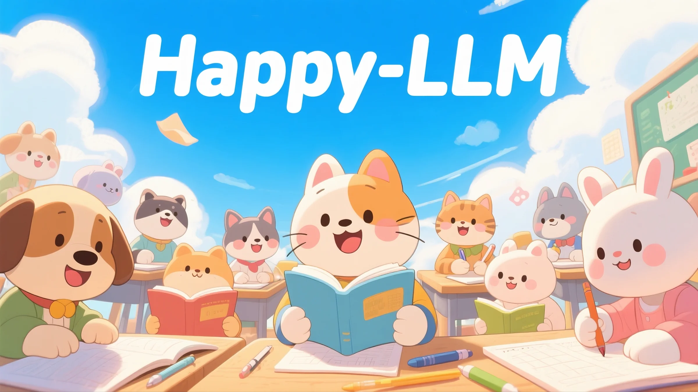
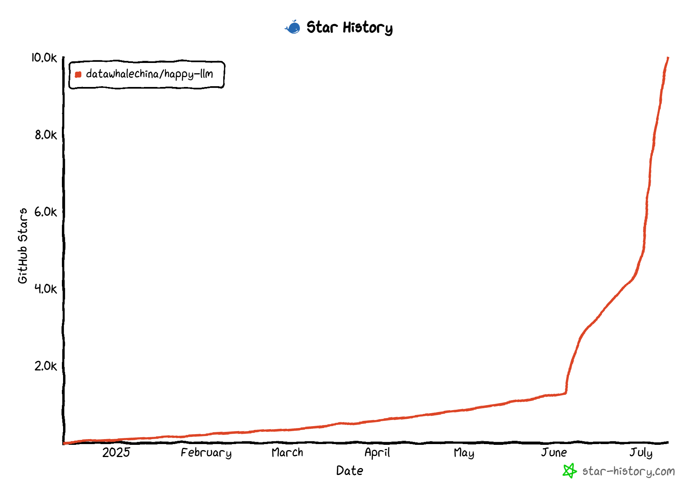
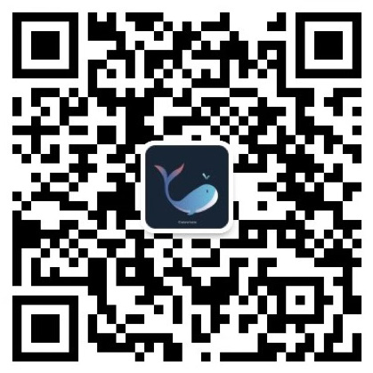

    
    <h1>Happy-LLM</h1>

  
  
  
  
  

  

  <h3>📚 Principles and Practical Tutorials for Large Language Models from Scrap</h3>
  
<em>In-depth understanding of the core principles of LLM and implement your first big model by hand</em>

---

## 🎯 Project Introduction

> &emsp;&emsp;*After reading the Datawhale open source project: [self-llm open source big model edible guide](https://github.com/datawhalechina/self-llm), many friends felt that they were still unsatisfied and wanted to have an in-depth understanding of the principles and training process of the big language model. So we (Datawhale) decided to launch the "Happy-LLM" project, aiming to help everyone understand the principles and training process of large language models in depth. *

&emsp;&emsp;This project is a ** systematic LLM learning tutorial**. Based on the basic research methods of NLP, we will go deeper layer by layer based on the ideas and principles of LLM, and analyze the architectural foundation and training process of LLM for readers in turn. At the same time, we will combine the most mainstream code framework in the LLM field to practice how to build and train an LLM by hand, in order to achieve the goal of teaching it to fish and also teach it to fish. I hope everyone can start from this book to enter the vast world of LLM and explore the endless possibilities of LLM.

### ✨What will you gain?

- 📚 **Datawhale Open Source Free** Completely Free Learn All Contents of this Project
- 🔍 **In-depth understanding** Transformer architecture and attention mechanism
- 📚 **Master** Basic principles of pre-trained language models
- 🧠 ** Understand the basic structure of existing large models
- 🏗️ **Practice on hand** A complete LLaMA2 model
- ⚙️ **Mastering Training** The entire process from pre-training to fine-tuning
- 🚀 **Practical application** Frontier technologies such as RAG, Agent

## 📖 Content navigation

| Chapters | Key Content | Status |
| --- | --- | --- |
| [Foreword](./Foreword.md) | The origin, background and readers' suggestions of this project | ✅ |
| [Chapter 1 Basic NLP Concept](./chapter1/Chapter 1%20NLP Basic NLP Concept.md) | What is NLP, development history, task classification, text representation evolution | ✅ |
| [Chapter 2 Transformer Architecture](./chapter2/Chapter 2 %20Transformer Architecture.md) | Attention mechanism, Encoder-Decoder, step-by-step construction Transformer | ✅ |
| [Chapter 3 Pre-trained Language Model](./chapter3/Chapter 3%20 Pre-trained Language Model.md) | Encoder-only, Encoder-Decoder, Decoder-Only Model Comparison | ✅ |
| [Chapter 4 Big Language Model](./chapter4/Chapter 4%20 Big Language Model.md) | LLM Definition, Training Strategy, and Analyzing Ability | ✅ |
| [Chapter 5: Build a big model](./chapter5/Chapter 5: %20: Build a big model.md) | Implement LLaMA2, train Tokenizer, pre-train small LLM | ✅ |
| [Chapter 6: Big Model Training Practice](./chapter6/Chapter 6: %20: Big Model Training Process Practice.md) | Pre-training, supervised fine-tuning, LoRA/QLoRA efficient fine-tuning | 🚧 |
| [Chapter 7 Big Model Application](./chapter7/Chapter 7%20 Big Model Application.md) | Model Evaluation, RAG Retrieval Enhancement, Agent Agent | ✅ |

### Model download

| Model name | Download address |
| --- | --- |
| Happy-LLM-Chapter5-Base-215M | [🤖 ModelScope](https://www.modelscope.cn/models/kmno4zx/happy-llm-215M-base) |
| Happy-LLM-Chapter5-SFT-215M | [🤖 ModelScope](https://www.modelscope.cn/models/kmno4zx/happy-llm-215M-sft) |

> *ModelScope Creation Space Experience Address: [🤖 Creation Space](https://www.modelscope.cn/studios/kmno4zx/happy_llm_215M_sft)*

### PDF version download

&emsp;&emsp;***This Happy-LLM PDF tutorial is completely open source and free. In order to prevent all kinds of marketing accounts from being sold to beginners after adding watermarks to big model, we have specially added Datawhale open source logo watermarks to the PDF file that do not affect reading. Please understand~***

> *Happy-LLM PDF : https://github.com/datawhalechina/happy-llm/releases/tag/PDF*  
> *Happy-LLM PDF Domestic download address: https://www.datawhale.cn/learn/summary/179*

## 💡 How to learn

&emsp;&emsp;This project is suitable for college students, researchers, and LLM enthusiasts. Before studying this project, it is recommended to have certain programming experience, especially to have a certain understanding of the Python programming language. It is best to have the knowledge of deep learning and understand the concepts and terms related to the NLP field to make it easier to learn this project.

&emsp;&emsp;This project is divided into two parts—basic knowledge and practical application. Chapter 1 to 4 are the basic knowledge part, introducing the basic principles of LLM from a shallow to deeper perspective. Among them, Chapter 1 briefly introduces the basic tasks and development of NLP, providing reference for researchers in non-NLP fields; Chapter 2 introduces the basic architecture of LLM - Transformer, including principle introduction and code implementation, as the most important theoretical basis of LLM; Chapter 3 introduces the classic PLM in an overall manner, including three architectures: Encoder-Only, Encoder-Decoder and Decoder-Only, and also introduces the architecture and ideas of some current mainstream LLM; Chapter 4 officially enters the LLM part, introducing in detail the characteristics, capabilities and overall training process of LLM. Chapter 5~Chapter 7 is the practical application part, which will gradually lead everyone to the underlying details of LLM. Among them, Chapter 5 will lead everyone to build an LLM based on the PyTorch layer and realize the entire process of pre-training and supervised fine-tuning; Chapter 6 will introduce the industry's mainstream LLM training framework Transformers, leading learners to quickly and efficiently implement the LLM training process based on the framework; Chapter 7 will introduce various applications based on LLM to complete learners' understanding of the LLM system, including LLM evaluation, retrieval-Augmented Generation (RAG), and agents and simple implementation. You can selectively read relevant chapters based on your personal interests and needs.

&emsp;&emsp;In the process of reading this book, it is recommended that you combine theory with practice. LLM is a rapidly developing and practical field. We recommend that you invest more in practice, reproduce the various codes provided in this book, and actively participate in LLM-related projects and competitions, and truly invest in the wave of LLM development. We encourage you to follow Datawhale and other LLM-related open source communities. When you encounter problems, you can ask questions in the issue area of this project at any time.

&emsp;&emsp;Lastly, every reader is welcome to join the ranks of LLM developers after completing this project. As a domestic AI open source community, we hope to gather co-creators to enrich this world of open source LLM and create more and more comprehensive tutorials on LLM. Sparks dotted, converging into the sea. We hope to be the ladder for LLM and the general public, embrace the more magnificent and vast LLM world with an open source spirit of freedom and equality.

## 🤝 How to contribute

We welcome any form of contribution!

- 🐛 **Report Bug** - Please submit if you find a problem
- 💡 **Function suggestions** - Tell us if you have good ideas
- 📝 **Complete content** - Help improve tutorial content
- 🔧 **Code Optimization** - Submit Pull Request

## 🙏 Acknowledgements

### Core Contributors
- [Song Zhixue - Project Leader](https://github.com/KMnO4-zx) (Datawhale member-China University of Mining and Technology (Beijing))
- [Zou Yuheng - Project Leader](https://github.com/logan-zou) (Datawhale member-University of International Business and Economics)
- [Zhu Xinzhong - Guidance Expert](https://xinzhongzhu.github.io/) (Chief Scientist of Datawhale - Professor of Hangzhou Artificial Intelligence Research Institute of Zhejiang Normal University)

### Special thanks
- Thanks [@Sm1les](https://github.com/Sm1les) for helping and supporting this project
- Thank you to all the developers who have contributed to this project ❤️

  

## Star History

    

  
⭐ If this project is helpful to you, please give us a Star! 

## About Datawhale

    
    
Scan the QR code to follow the Datawhale official account to get more high-quality open source content

---

## 📜 Open Source Protocol

This work is licensed under the [Creative Commons Attribution-Non-Commercial Use-Share the same way 4.0 International License] (http://creativecommons.org/licenses/by-nc-sa/4.0/).
